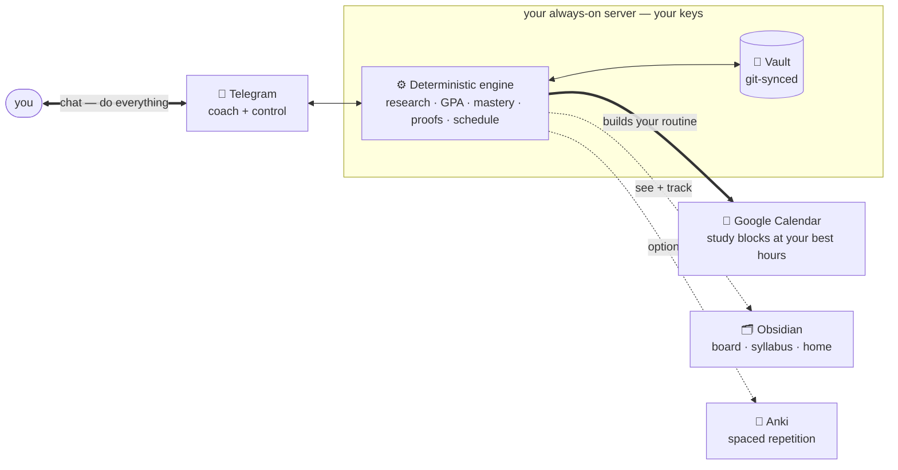

# 🎓 Hermes University

**A personal university with one student and one objective — you, and the single thing you want to
become great at.** Tell a Telegram bot your goal; it researches the field, builds you a real *cited*
curriculum, books the work onto your own calendar around your actual days, and coaches you toward that
one objective every day — with a deterministic engine tracking real mastery, never guesswork. No cohort,
no fixed schedule to fall behind, no SaaS: your server, your keys.

<p align="left">
  
  
  
  
</p>

## What it's like
You talk to a Telegram bot. Everything else happens around you.

```text
You  ▸  create course  become a great AI engineer

Bot  ▸  Love it — a few quick questions so I build this around *you*:
        where are you with ML now, how many hours a week, and by when?
        …
Bot  ▸  📎 Here's a deep-research prompt. Run it in Claude and drop the report
        back — I design the course from real sources, never from memory.

You  ▸  «uploads the research report»

Bot  ▸  Built  AI Engineering  — 2 semesters · 8 units · cited materials and a
        week-by-week plan. Want a short placement exam to skip what you know?

───────────────  next morning, 8:00  ───────────────

Bot  ▸  ☀️ Today — booked 20:00–21:30 on your calendar (your best hours):
        1.  Read  — "Attention Is All You Need", §3
        2.  Build — a toy self-attention head, ≤ 40 lines
        Reply `done` with a link when the proof is in.

You  ▸  done  github.com/…/attention.py

Bot  ▸  ✓ Verified against the rubric. 🔥 6-day streak · Anki card queued.
        Tomorrow: multi-head attention.
```

<!-- SCREENSHOTS: drop GIFs/PNGs here — (1) the exchange above in Telegram · (2) the Obsidian Kanban
     board · (3) a rendered Syllabus.md. Real visuals sell it. -->

## Why it's different
- **One objective, not a course catalog.** You don't browse subjects — you name the single thing you
  want to become, and everything (the curriculum, the schedule, the daily tasks, the whole transcript)
  exists only to get you there.
- **Built around your life, not a fixed schedule.** It reads your real calendar, finds your free time,
  and books each day's study at your best hours on a dedicated *Mentor* calendar — then re-paces the plan
  month over month from how you're actually doing. No cohort, no course calendar to fall behind.
- **It researches, it doesn't hallucinate.** Course design is grounded in a real, cited research report
  (you run a deep-research prompt in Claude; it authors from that) plus mandatory web search — a
  machine-checked gate rejects any course built from the model's memory.
- **It starts from fundamentals, then tests you out.** Every course is built complete from the ground up;
  a rigorous **placement exam** decides what to skip — never an assumption about your level.
- **The numbers are real.** A deterministic engine owns GPA, mastery, streak, standing, and promotion —
  the LLM only teaches and grades to a rubric. **No outcome without a proof.**
- **A course is data, not code.** One `course.yaml` holds the whole curriculum + teaching profile +
  mastery model. One professor skill teaches *any* course. Add a subject, not a subsystem.
- **You own it end-to-end.** Self-hosted on the open [Hermes Agent](https://github.com/NousResearch/hermes-agent),
  your keys, model-agnostic (DeepSeek by default). Progress is git-backed and portable.

## How it works
One brain — a deterministic engine on your server — and a few ways to reach it. Most of the time you
only touch the first.



- **Telegram — where you live.** Your coach *and* control panel: daily nudges, every command, voice
  answers, files. Routine work never needs anything else.
- **Google Calendar — where your routine lives.** The engine reads your real schedule, finds your free
  hours, and books each day's study on a dedicated calendar you can toggle or wipe.
- **Obsidian — where you look.** A **Kanban board** you track work on, a live **Home** dashboard, and
  every syllabus / resource / transcript. Two-way — drag a card to *Done* and the night audit verifies it.
- **Anki — optional retention.** Turn it on and proven concepts become spaced-repetition cards on your
  phone (FSRS). Leave it off and everything else still works. *(Plus an optional daily tech/AI briefing.)*

## Quickstart
```bash
git clone https://github.com/AlijonovMukhammaddiyor/hermes-university.git
cd hermes-university
./setup.sh        # guided: enters your keys, wires the agent, installs everything
```
You'll need an always-on Linux host with the [Hermes Agent](https://github.com/NousResearch/hermes-agent),
an LLM key, a Telegram bot, and a web-search key (Calendar/Anki optional) — full list in
**[PREREQUISITES.md](PREREQUISITES.md)**. Then install the **Kanban · Dataview · Obsidian Git** plugins
in Obsidian, and message the bot **`create course <your goal>`** — it takes it from there.

## Using it
**Talk to the bot to *do* things · open Obsidian to *see* things · open Anki to *review*.** You never
touch a terminal for routine work, and every destructive action is confirmed. Check progress toward your
objective, adjust the goal, or extend the curriculum — all from Telegram (`status · create · courses ·
profile`). **Full command manual → [GUIDE.md](GUIDE.md).**

## Never lose progress
Your state, grades, authored courses, and an encrypted secrets bundle are backed up to a private git
vault daily. Move to a new server with one command — `./bootstrap.sh <code-url> <vault-url>` — and
everything restores. Details → **[docs/REDEPLOY-runbook.md](docs/REDEPLOY-runbook.md)**.

## Principles
1. Numbers are computed by code, not the model. 2. No outcome without a proof. 3. A course is data, not
code. 4. Personalize to your **goals**, never your work. 5. No hardcoded personal/organizational data —
identity lives in one git-ignored `profile.yaml`.

## Learn more
- **[GUIDE.md](GUIDE.md)** — day-to-day: commands, the daily loop, the surfaces.
- **[ARCHITECTURE.md](ARCHITECTURE.md)** — how it works (engine · skills · courses · lifecycle).
- **[PREREQUISITES.md](PREREQUISITES.md)** — the accounts/keys + Obsidian plugins.
- **[CONTRIBUTING.md](CONTRIBUTING.md)** · **`docs/RFC-00*.md`** — how to help + the design record.

## Built on
The [Hermes Agent](https://github.com/NousResearch/hermes-agent) (skills, cron, Telegram gateway) + a
deterministic Python engine. Model-agnostic via the provider seam (DeepSeek by default).

## License
[MIT](LICENSE).
