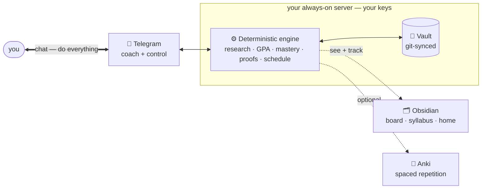
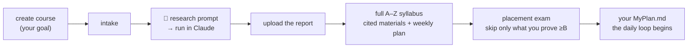

# 🎓 Hermes University

**A personal university that molds to your life — not the other way around.** Tell it a goal; it
**researches the field** and **builds you a real course** (full A–Z syllabus, best-in-class materials),
a **placement exam** skips what you already know, and it **teaches you day by day on your own schedule** —
coaching over Telegram, tracking real mastery with an engine. No cohort, no someone-else's calendar to
keep up with. Everything personalizes to *you*: your goals, your level, your hours. Your server, your
API keys, no SaaS.

<p align="left">
  
  
  
  
</p>

> *"I want to be one of the best AI engineers."* → a researched, cited course; a placement exam so it
> skips what you already know; daily proof-gated tasks; and a transcript that actually means something.

<!-- SCREENSHOTS: (1) Telegram create-course + research handoff · (2) the Obsidian Kanban board ·
     (3) a rendered Syllabus.md with the week-by-week plan. Add GIFs/PNGs here — visuals sell it. -->



## Why it's different
- **Built around your life, not a fixed schedule.** No cohort to join, no course calendar to fall behind
  — it plans around your real days and your pace, and adapts as you go. Level, workload, timing, subject:
  all personalized to you.
- **It researches, it doesn't hallucinate.** Course design is grounded in a real, cited research report
  (you run a deep-research prompt in Claude; it authors from that) plus mandatory web search — a
  machine-checked gate rejects any course built from the model's memory.
- **It starts from fundamentals, then tests you out.** Every course is built complete from the ground up;
  a rigorous **placement exam** decides what to skip — never an assumption about your level.
- **The numbers are real.** A deterministic engine owns GPA, mastery, streak, standing, and promotion —
  the LLM only teaches and grades to a rubric. **No outcome without a proof.**
- **A course is data, not code.** One `course.yaml` holds the whole curriculum + teaching profile +
  mastery model. One professor skill teaches *any* course. Add a subject, not a subsystem.
- **You own it end-to-end.** Self-hosted on the open [Hermes Agent](https://github.com/NousResearch/hermes-agent),
  your keys, model-agnostic (DeepSeek by default). Progress is git-backed and portable.

## How a course gets built


## One brain, three surfaces
The engine is the brain; you reach it three ways — most of the time, just the first:
- **Telegram — where you live.** Your coach *and* control panel: daily nudges, every command, voice
  answers, files. Routine work never needs anything else.
- **Obsidian — where you look.** A **Kanban board** you track work on, a live **Home** dashboard, and
  every syllabus / resource / transcript. Two-way — drag a card to *Done* and the night audit verifies it.
- **Anki — optional retention.** Turn it on and proven concepts become spaced-repetition cards on your
  phone (FSRS), lapses coming back for review. Leave it off and everything else still works.

Plus, both optional: a **daily tech/AI/engineering briefing** (curated blogs + news — the few things
worth reading) and a **Google-Calendar** study schedule that plans around *your* days.

## Quickstart
```bash
git clone https://github.com/AlijonovMukhammaddiyor/hermes-university.git
cd hermes-university
./setup.sh        # guided: enters your keys, wires the agent, installs everything
```
See **[PREREQUISITES.md](PREREQUISITES.md)** for the accounts/keys to get first (an always-on Linux host
with the Hermes Agent, an LLM key, a Telegram bot, a web-search key; Anki/Calendar optional). Then in
Obsidian install the **Kanban · Dataview · Obsidian Git** plugins, and message the bot
**`create course <your goal>`** — it takes it from there.

## Using it
**One rule: talk to the bot to *do* things · open Obsidian to *see* things · open Anki to *review*.** You
never touch a terminal for routine work. Morning it assigns your tasks; you do them and drag a card to
**Done** (or reply `done`); night it verifies the proof — unverified work bounces, never a fake pass —
and proven concepts become Anki cards. Manage everything by course name from Telegram
(`courses · status · create · enroll · archive · delete · profile`), each destructive action confirmed.
**Full command manual → [GUIDE.md](GUIDE.md).**

## Never lose progress
Your state, grades, authored courses, and an encrypted secrets bundle are backed up to a private git
vault daily. Move to a new server with one command — `./bootstrap.sh <code-url> <vault-url>` — and
everything restores. Details → **[docs/REDEPLOY-runbook.md](docs/REDEPLOY-runbook.md)**.

## Principles
1. Numbers are computed by code, not the model. 2. No outcome without a proof. 3. A course is data, not
code. 4. Personalize to your **goals**, never your work. 5. No hardcoded personal/organizational data —
identity lives in one git-ignored `profile.yaml`.

## Learn more
- **[GUIDE.md](GUIDE.md)** — day-to-day: commands, the daily loop, the surfaces.
- **[ARCHITECTURE.md](ARCHITECTURE.md)** — how it works (engine · skills · courses · lifecycle).
- **[PREREQUISITES.md](PREREQUISITES.md)** — the accounts/keys + Obsidian plugins.
- **[CONTRIBUTING.md](CONTRIBUTING.md)** · **`docs/RFC-00*.md`** — how to help + the design record.

## Built on
The [Hermes Agent](https://github.com/NousResearch/hermes-agent) (skills, cron, Telegram gateway) + a
deterministic Python engine. Model-agnostic via the provider seam (DeepSeek by default).

## License
[MIT](LICENSE).
