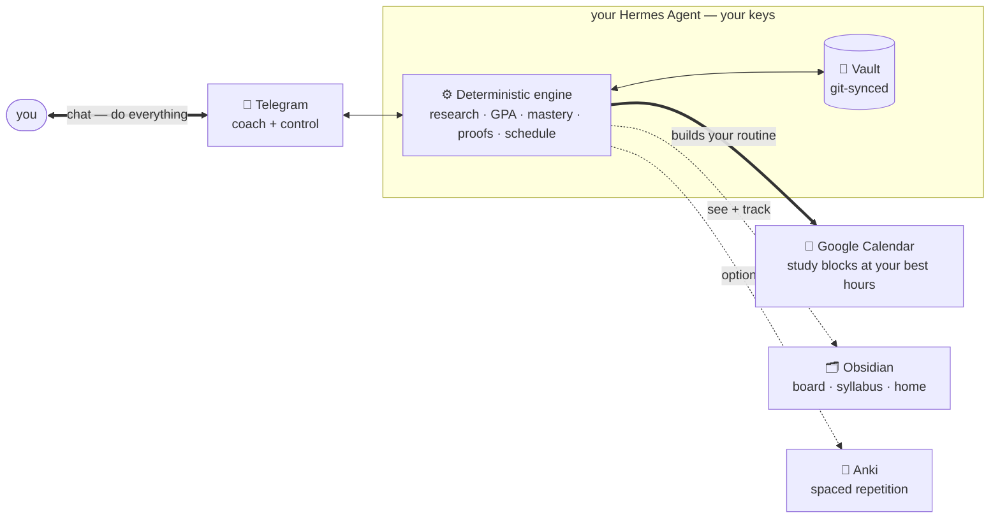

# 🎓 Hermes University

**A Hermes-based learning system that teaches you properly and builds it around your day.**

You give it something you want to get good at. It builds real, research-based courses, teaches them
concept-first, and grades what you actually learned from proof — and it fits all of that around your real
days: reading your calendar, finding your free time and the hours you focus best, booking the work there,
and re-pacing as it keeps learning you. You use it over Telegram.

<p align="left">
  
  
  
  
</p>

> **This page has everything** — what it does, what you'll need, how to set it up, and how to use it. The
> docs linked at the bottom are optional.

**Jump to:** [What it's like](#what-its-like) · [Why it's different](#why-its-different) ·
[How it works](#how-it-works) · [What you'll need](#what-youll-need) · [Set it up](#set-it-up) ·
[Using it every day](#using-it-every-day) · [Never lose progress](#never-lose-progress)

## What it's like
You talk to a Telegram bot; everything else happens around you.

```text
You  ▸  create course  become a great AI engineer

Bot  ▸  A few quick questions so I build this around you: where are you with
        ML now, how many hours a week, and by when?
        …
Bot  ▸  📎 Here's a research prompt. Run it in Claude and drop the report back —
        I build the course from real sources, not from memory.

You  ▸  «uploads the research report»

Bot  ▸  Built  AI Engineering  — 8 units, cited materials, a week-by-week plan.
        Want a short placement exam to skip what you already know?

───────────────  next morning, 8:00  ───────────────

Bot  ▸  ☀️ Today — booked 20:00–21:30 on your calendar (your best hours):
        1.  Read  — "Attention Is All You Need", §3
        2.  Build — a toy self-attention head, ≤ 40 lines
        Reply `done` with a link when it's in.

You  ▸  done  github.com/…/attention.py

Bot  ▸  ✓ Checked against the rubric. 🔥 6-day streak · Anki card queued.
        Tomorrow: multi-head attention.
```

<!-- SCREENSHOTS: add real captures on the next deploy — (1) the exchange above in Telegram ·
     (2) the Obsidian Kanban board · (3) a rendered Syllabus.md. -->

## Why it's different
- **Your curriculum is built for you, not browsed.** You say what you want to get good at, and it
  researches the field and builds the courses for it — pointed at your goal, not generic ones off a shelf.
- **It fits your life, not a fixed schedule.** It reads your calendar, books each day's work at your best
  hours, and re-paces month to month from how you're actually doing. No cohort to keep up with.
- **It researches; it doesn't make things up.** Each course is built from a real, cited research report
  (you run a deep-research prompt in Claude and hand it back) plus web search. A machine check rejects
  anything built from the model's memory.
- **It starts from the ground up, then tests you out.** Every course is complete from fundamentals; a
  placement exam decides what to skip — not a guess about your level.
- **Mastery is measured, not assumed.** A deterministic engine owns mastery, GPA, streak, and standing;
  the AI only teaches and grades to a rubric. Nothing counts without a proof.
- **It's yours.** Runs on your own Hermes Agent, your keys, model-agnostic (DeepSeek by default). Progress
  is backed up to your own git and moves to a new machine in one command.

## How it works
One brain — a deterministic engine running in your Hermes Agent — and a few ways to reach it. Most of the
time you only touch the first.



- **Telegram** — your coach and control panel: daily nudges, every command, voice answers, files. Routine
  work needs nothing else.
- **Google Calendar** — your daily routine: it reads your real schedule, finds your free hours, and books
  each day's study on a calendar you can toggle or wipe.
- **Obsidian** — where you read and track: a Kanban board, a live Home dashboard, and every syllabus and
  transcript. Drag a card to Done and the night audit checks it.
- **Anki** — optional: proven concepts become spaced-repetition cards on your phone. Leave it off and the
  rest still works. (There's an optional daily tech/AI briefing too.)

## What you'll need
An *API key* is just a secret password a service gives you; the setup wizard asks for each one, so grab
them first.

| What | Why | Need it? | Where to get it |
|---|---|---|---|
| An **always-on computer** | so your coach keeps running when your laptop is closed | ✅ | any cheap Linux/macOS cloud server (a "VPS", ~1–2 GB RAM) |
| The **Hermes Agent** | the free runtime everything runs on | ✅ | one install command (below) |
| An **AI model key** (DeepSeek) | the brain that teaches and grades | ✅ | [platform.deepseek.com](https://platform.deepseek.com) |
| A **Telegram bot** | the coach you chat with | ✅ | a token from [@BotFather](https://t.me/BotFather) + your id from [@userinfobot](https://t.me/userinfobot) |
| A **web-search key** (Serper) | grounds course research in real sources | ✅ | [serper.dev](https://serper.dev) (free tier) |
| An **AnkiWeb** account | spaced-repetition review on your phone | optional | [ankiweb.net](https://ankiweb.net) |
| A **Google** account | to book study on your calendar | optional | Google Cloud console (a one-time sign-in) |

## Set it up
Three commands, then you just chat.

**1. Install the Hermes Agent** on your always-on computer (it bundles everything it needs):
```bash
curl -fsSL https://hermes-agent.nousresearch.com/install.sh | bash
```

**2. Run the setup wizard** — it asks for the keys above and wires them in:
```bash
git clone https://github.com/AlijonovMukhammaddiyor/hermes-university.git
cd hermes-university
./setup.sh
```
It writes your keys into the agent, installs the web-search plugin, and sets up the engine, your vault,
the skills, and the daily automations.

**3. Start the coach and say hello:**
```bash
hermes gateway install && hermes gateway start
```
Then message your bot: **`create course <what you want to get good at>`**.

**See your progress in Obsidian (recommended).** Point [Obsidian](https://obsidian.md) at the vault
(`~/vault`) and install three free plugins — **Kanban** (your task board), **Dataview** (the dashboard),
and **Obsidian Git** (keeps it in sync). Now you can watch the board and read every syllabus and transcript.

**Put study on your calendar (optional).** In the [Google Cloud console](https://console.cloud.google.com):
enable the *Google Calendar API*, create an *OAuth client → Desktop app*, and download the JSON to
`~/.hermes/gcp-oauth.keys.json`. The wizard asks for that path and registers the calendar; you approve it
in a browser once (see [PREREQUISITES.md](PREREQUISITES.md) — publish the consent screen, or Google expires
the login weekly). Only that sign-in is manual; the rest is automatic.

> **The one manual step, by design:** when you create a course, the bot hands you a research prompt to run
> in [Claude](https://claude.ai) (Deep Research). You drop the report back into your vault and it builds
> the course *from those real sources* — that's why courses are cited, never made up.

## Using it every day
**Talk to the bot to *do* things · open Obsidian to *see* things · open Anki to *review*.** You never touch
a terminal for routine work, and every destructive action asks first.

The daily loop — you mostly just do the work and mark it done:
- **Morning** — the bot assigns the day's tasks (a lesson + a sized task), adds them to your **Today**
  board, and books study blocks on your calendar.
- **During the day** — do a task, then reply **`done`** with a link (or drag its card to **Done** in
  Obsidian). Answer quizzes by text or voice.
- **Night** — the audit checks each task's **proof**. Verified counts; not verified moves to *Proof
  Pending* (never a fake pass). Proven concepts become **Anki cards** automatically.

Everything is a chat command, by course **name**:

| Say this | It does |
|---|---|
| `status` | where you are: courses, what's due, what's blocked on you, your streak |
| `create course <goal>` | research and build a new course |
| `courses` | list available and enrolled courses with their status |
| `enroll <name>` | start a course (builds it first if needed, then a placement exam) |
| `done <link>` | mark today's task done |
| `archive <name>` | soft-drop — hides it, keeps everything, reversible (`restore` to undo) |
| `delete <name>` | hard delete — removes it for good (you re-type the command to confirm) |
| `tailor <name>` | re-run placement, adjust pace and depth |
| `pause` · `resume <name>` | stop or restart its daily assignments |
| `profile` · `set goal <…>` · `set daily cap <n>` | see and steer what it builds toward |

## Never lose progress
Your goal, grades, courses, and an encrypted copy of your keys back up to your own private git every day.
Moving to a new computer is one command — `./bootstrap.sh <code-url> <vault-url>` — and it all restores.

## Principles
1. Numbers come from code, not the model. 2. No outcome without a proof. 3. A course is data, not code.
4. It personalizes to your **goals**, not your job. 5. No personal data hardcoded — your identity lives in
one private `profile.yaml`.

## Go deeper (optional)
- **[GUIDE.md](GUIDE.md)** — the full command manual, the daily loop in depth, troubleshooting.
- **[ARCHITECTURE.md](ARCHITECTURE.md)** — how it works inside (engine · skills · courses · lifecycle).
- **[PREREQUISITES.md](PREREQUISITES.md)** — the accounts and keys on their own.
- **[CONTRIBUTING.md](CONTRIBUTING.md)** · **`docs/RFC-00*.md`** — how to help and the design record.

## Built on
The [Hermes Agent](https://github.com/NousResearch/hermes-agent) (skills, cron, Telegram gateway) and a
deterministic Python engine. Model-agnostic via the provider seam (DeepSeek by default).

## License
[MIT](LICENSE).
